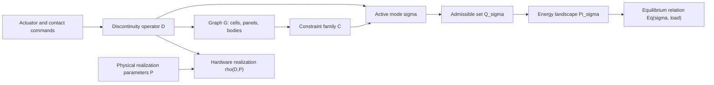

# Monograph Notes: A Mathematical Framework for Programmable Discontinuities

Status: technical monograph draft v0.1  
Purpose: definitions, examples, theorem targets, and simulator linkage

## 1. Motivation

The useful object is not only a deforming lattice. It is a system whose active
mathematical description changes under controlled events. RADs expose this
clearly because local backlash, locks, actuator commands, pin-hole clearance,
and possible cell removal all alter how deformation propagates.

The same pattern occurs in:

- origami: crease locks, fold branch changes, self-contact;
- kirigami: cuts and slits changing compatibility;
- metamaterials: unit-cell switching, buckling, multistability;
- soft robotics: contact, pressure chambers, variable stiffness;
- deployable mechanisms: latches, braces, link engagement;
- mechanical computation: event order, memory, and noncommutative operations.

## 2. Objects



### 2.1 Graph and topology

Let `G = (V, E)` be a graph of cells, rigid bodies, panels, or modules. A
topology-changing event rewrites `G`.

Examples:

- RAD cell removal: delete vertex and incident edges.
- Kirigami activation: delete or enable compatibility edges.
- Modular robotics: add or remove docking edges.
- Origami contact: add temporary contact edges.

Lean status: `CellGraph.removeCell` proves removed cells are absent and incident
edges are deleted.

### 2.2 Configuration space

Let `Q` be the ambient configuration space. For a rigid-body RAD approximation,
`q` may contain body poses, hinge angles, pin positions, contact states, and
surface-node heights. For a graph abstraction, `q` may only contain cell alpha,
theta, z, command, and lock state.

Claim status: framework definition; not fully Lean-formalized.

### 2.3 Constraints and active modes

Let `C` be a family of constraints. A mode is a Boolean activation map:

```text
sigma : C -> Bool
```

Admissibility is:

```text
q is admissible iff every active constraint is satisfied.
```

Lean status: `Mode`, `active`, `MechanicalSystem.admissible`.

### 2.4 Discontinuity operators

An operator changes one or more of:

- active constraints;
- graph topology;
- contact state;
- actuator command;
- constitutive branch;
- equilibrium branch;
- solver mode.

At mode level:

```text
D : Mode C -> Mode C
```

At full mechanics level:

```text
D : S^- -> S^+
```

Lean status: `LocalModeOperator`, `ModeOperator`, `composeOperators`,
`applyEventSequence`.

### 2.5 Support, locality, and die-off

Support is direct influence. Die-off is propagated influence. They are distinct:

- support: cells/constraints the event directly rewrites;
- locality radius: cells affected after propagation;
- die-off distance: first shell where response falls below threshold or reaches
  zero.

RAD-specific note: backlash can make influence exactly zero within a gap and
attenuate neighbor propagation outside the gap.

## 3. Operators

### 3.1 Lock and unlock

Lock activates a constraint. Unlock deactivates it.

Proved:

- lock is idempotent;
- unlock is idempotent;
- lock shrinks admissible configurations;
- unlock enlarges admissible configurations.

### 3.2 Actuation

Actuation changes command parameters and may change equilibrium, but it need not
change active constraints unless it crosses a contact, backlash, saturation, or
lock threshold.

Claim status: simulator operator; physical version requires actuator-force and
displacement calibration.

### 3.3 Cell removal

Cell removal is a topology event:

```text
remove(v): (V, E) -> (V \ {v}, E \ incident(v))
```

It may also deactivate every constraint touching the removed cell.

Proved abstraction:

- removed cell is no longer present;
- incident edges are deleted;
- constraints touching the removed cell become inactive.

### 3.4 Group actuation

Group actuation may be modeled two ways:

- simultaneous operator with support equal to a union of cells;
- sequence of single-cell operators.

If supports are disjoint and no shared threshold/contact is crossed, the
operators commute in the abstract mode model. If thresholds are crossed or
supports interact through mechanics, order can matter.

Proved abstraction: disjoint-support commutation.  
Simulator status: event-order and pairwise interaction diagnostics already
exist.

## 4. Mechanics Layers

### 4.1 Layer 0: active-set algebra

This is the current strongest Lean layer. It studies modes and operators
without assuming detailed physics.

### 4.2 Layer 1: graph constraint abstraction

Cells and constraints form graphs. Removal, locks, and contacts are graph
rewrites or active-set changes.

### 4.3 Layer 2: kinematic backlash

RAD backlash uses:

```text
f(x) = max(0, x - b) + min(x + b, 0)
```

Proved status: integer-valued branches compile in Lean.  
Target status: real-valued branches should be moved to mathlib once the cache is
available and build time is acceptable.

### 4.4 Layer 3: variational mechanics

Candidate energy:

```text
Pi_sigma(q) =
  E_bar(q) + E_hinge(q) + E_contact(q) +
  E_lock_sigma(q) + E_actuator(q) + E_gravity(q)
```

Current Lean status:

- toy `Nat` spring/hinge/contact energies are nonnegative;
- `RealValuedEnergyTargets` records the premises needed for future real-valued
  proofs.

The equilibrium map should be treated as a relation, not a single function:

```text
Eq(sigma, load) = admissible stable or stationary configurations in mode sigma.
```

This is important because contact, buckling, backlash, and multistability can
make the same mode/load pair have multiple stable branches.

### 4.5 Layer 4: rigid-body contact

RAD physical realism requires bodies, pin joints, hole radii, active contacts,
clearance, friction, gravity, and actuator forces. This should be validated
against an external physics engine or measured experiments before being treated
as predictive.

## 5. Theorem Targets

| ID | Statement | Status |
| --- | --- | --- |
| T1 | Identity event leaves a mode unchanged. | Lean-proven |
| T2 | Event composition is associative. | Lean-proven |
| T3 | Sequence application respects list append. | Lean-proven |
| T4 | Lock and unlock are idempotent. | Lean-proven |
| T5 | Adding constraints shrinks admissible set. | Lean-proven |
| T6 | Removing constraints enlarges admissible set. | Lean-proven |
| T7 | Disjoint-support operators commute. | Lean-proven |
| T8 | List-supported group operators expose every listed support cell, empty group operators are neutral, and disjoint list-supported groups commute. | Lean-proven |
| T9 | Removed-cell constraint deletion clears constraints touching the removed cell even after group-operator application. | Lean-proven |
| T10 | Cell removal deletes incident edges. | Lean-proven |
| T11 | Backlash is zero inside the gap and linear outside. | Lean-proven for `Int`; real target pending |
| T12 | Spring/hinge/contact penalties are nonnegative. | Lean-proven for `Nat`; real target pending |
| T13 | Clearance excess, clearance-gated vertical residual transmission, and clearance-excess contact penalty satisfy zero-inside-gap and nonnegative-penalty facts. | Lean-proven for `Nat`; real target pending |
| T14 | Load-work magnitude is nonnegative, and fixed zero-displacement cells contribute zero load work. | Lean-proven for `Nat`; real target pending |
| T15 | Signed finite load work is zero for zero load or zero displacement, and signed residual triples vanish when signed measured and simulated quantities agree. | Lean-proven for `Int`; real target pending |
| T16 | Integer-scaled spring/contact energies and signed residuals preserve denominators and retain zero/nonnegative numerator facts. | Lean-proven for denominator-carrying `Nat`/`Int` records; `Rat`/`Real` target pending |
| T17 | Measurement-unit scaling preserves zero commands, equality-residual zeros, and denominator metadata for unsigned and signed finite quantities. | Lean-proven for denominator-carrying `Nat`/`Int` records; calibrated-unit target pending |
| T18 | Calibration fit residual bookkeeping passes when at least one finite sample has zero fitted residual. | Lean-proven for `Nat` records; fitted physical parameter validity remains empirical |
| T19 | Calibration model-profile safe updates require at least one finite sample and a proposed bounded parameter inside declared bounds. | Lean-proven for `Nat` records; physical parameter validity remains empirical |
| T20 | Calibration model-profile selection requires an applied update, non-increased residual score, and non-increased missing observations. | Lean-proven for `Nat` records; independent validation data still required |
| T21 | Calibration model-profile holdout validation requires non-increased fit and holdout residuals and missing-observation counts after an applied update. | Lean-proven for `Nat` records; holdout independence is experimental protocol, not theorem |
| T22 | Calibration train/holdout split readiness requires positive fit and holdout samples, zero overlap, and a frozen profile. | Lean-proven for `Nat` records; file provenance must be enforced by the lab protocol |
| T23 | Calibration train/holdout file provenance requires known fit and holdout IDs, distinct dataset/source-file IDs, marked roles, a frozen profile, and matching holdout profile ID. | Lean-proven for `Nat` records; notebook/file provenance remains external evidence |
| T24 | Calibration bench protocol coverage requires at least one scenario, instrument, output artifact, measurement column, and both fit and holdout dataset roles. | Lean-proven for `Nat` records; independent execution and physical calibration remain external evidence |
| T25 | Calibration bench packet completeness requires notebook artifacts, protocol artifacts, fit and holdout templates, validation instructions, and a populated manifest. | Lean-proven for `Nat` records; returned raw files and physical calibration remain external evidence |
| T26 | Executed calibration bench validation requires positive fit and holdout samples, an applied update, residual and independent-validation flags, and zero missing evidence. | Lean-proven for `Nat` records; lab procedure and physical-law accuracy remain external evidence |
| T27 | Physical-validation readiness requires executed calibration, passing vertical-load comparison, load/contact proxy terms, configured clearance, and zero missing evidence. | Lean-proven for `Nat` records; contact, gravity, friction, stiffness, and material-law accuracy remain external evidence |
| T28 | Contact-state abstraction readiness requires active bodies with matching pin, hole, and clearance records plus contact-state and penalty records. | Lean-proven for `Nat` records; collision geometry, friction, and stiffness remain external evidence |
| T29 | Contact-graph consistency requires deleted removed-cell incident edges, inactive removed-cell contacts, active-body contact records, represented group supports, and zero missing evidence. | Lean-proven for `Nat` records; physical contact, collision geometry, friction, and stiffness remain external evidence |
| T30 | Physical realization-map readiness requires abstract operators, realized simulator state effects, support records, claim labels, contact-graph evidence, and zero missing evidence. | Lean-proven for `Nat` records; real hardware realization remains external experimental evidence |
| T31 | External physics-engine audit readiness requires independent engine candidates, at least one available tool, required feature records, validation scenario records, contact-model records, independent-tool records, and zero missing evidence. | Lean-proven for `Nat` records; MuJoCo/PyBullet/Chrono execution and physical agreement remain external evidence |
| T32 | MuJoCo model-export readiness requires model, active body, fixed body, gravity, MJCF XML byte, and zero-missing-evidence records. | Lean-proven for `Nat` records; exported geometry is a normalized proxy rather than fabrication-accurate contact CAD |
| T33 | MuJoCo pin-hole contact-geometry readiness requires pin, hole, clearance, contact-pair, active-pair, MJCF fragment, and zero-missing-evidence records. | Lean-proven for `Nat` records; proxy geometry is not calibrated friction/contact/compliance |
| T34 | MuJoCo contact-parameter profile readiness requires contact-pair, parameter, friction, solver, stiffness, damping, XML-attribute, and zero missing evidence records. | Lean-proven for `Nat` records; proxy stiffness, damping, friction, and solver settings remain uncalibrated until backed by bench data |
| T35 | Contact-parameter calibration-packet completeness requires contact-pair records, parameter records, measurement columns, fit and holdout template rows, artifact-manifest entries, attached profile evidence, and zero missing evidence. | Lean-proven for `Nat` records; blank rows are a bench handoff, not contact calibration |
| T36 | Contact-parameter bench-validation readiness requires a ready packet, fit rows, holdout rows, completed measurements covering both, parameter residual checks, fit pass, holdout pass, independent holdout pass, and zero missing evidence. | Lean-proven for `Nat` records; passing is empirical fit/holdout evidence, not a first-principles contact law |
| T37 | Contact-parameter interval-calibration readiness requires a passing bench validation, parameter intervals, accepted interval records, uncertainty records, holdout-agreement records, simulator parameters inside bounds, and zero missing evidence. | Lean-proven for `Nat` records; intervals are empirical bounds, not constitutive contact laws |
| T38 | MuJoCo external-run readiness requires engine availability, a ready export, body records, result records covering bodies, positive requested steps, completed steps, and zero missing evidence. | Lean-proven for `Nat` records; actual execution depends on the optional external package and still needs comparison |
| T39 | MuJoCo external-comparison readiness requires a complete run, simulator records, external and matched records covering simulator records, tolerance evidence, within-tolerance status, and zero missing evidence. | Lean-proven for `Nat` records; passing body-center agreement is not bench validation |
| T40 | Equilibrium-relation readiness requires realization evidence, solver success, contact evidence, nonnegative energy terms, residual within tolerance, and zero missing evidence. | Lean-proven for `Nat` records; continuous minimization, material laws, and calibrated contact remain external evidence |
| T41 | Reachable-equilibrium controllability readiness requires equilibrium evidence, an actuator basis, response columns, target cells, reachable responses, topology evidence, optional full-target policy, and zero missing evidence. | Lean-proven for `Nat` records; nonlinear controllability and physical feasibility remain external evidence |
| T42 | Reachable-equilibrium bench protocol readiness requires attached controllability evidence, scenarios, actuator-column trials, target observations, measurement columns, topology-control policy, pass/fail criteria, and zero missing evidence. | Lean-proven for `Nat` records; lab execution and physical controllability remain external evidence |
| T43 | Reachable-equilibrium bench validation readiness requires a ready protocol, result rows, target measurements, completed measurements, reachability checks, topology-leakage checks, group-sequence checks, a passing comparison, and zero missing evidence. | Lean-proven for `Nat` records; calibrated physical laws remain external evidence |
| T44 | Reachable-equilibrium amplitude calibration readiness requires a passing bench validation, repeated-trial groups, amplitude estimates, residual-field cells, uncertainty bands, topology-leakage bands, group-sequence residuals, and zero missing evidence. | Lean-proven for `Nat` records; statistical inference and constitutive mechanics remain external evidence |
| T45 | Reachable-equilibrium empirical profile readiness requires amplitude calibration evidence, bounded proposals, safe proposals, tolerance records, uncertainty records, holdout hooks, and zero missing evidence. | Lean-proven for `Nat` records; profile semantics and hardware validity remain external evidence |
| T46 | Profile-aware inverse diagnostic readiness requires a ready empirical profile, safe proposals, target cells, inverse-solve evidence, residual records, score terms, read-only profile use, and zero missing evidence. | Lean-proven for `Nat` records; it is a residual certificate, not a nonlinear reachability proof or calibrated physical inverse solver |
| T47 | Profile-aware inverse acceptance requires a ready profile-inverse report, score records, scaled residual score within limit, band failures within limit, actuator count within budget, acceptance-for-preview flag, and zero missing evidence. | Lean-proven for `Nat` records; preview acceptance is not hardware execution authorization |
| T48 | Profile-aware inverse preview-packet readiness requires accepted inverse evidence, command records, event records covering commands, target records, residual records, read-only packet status, and zero missing evidence. | Lean-proven for `Nat` records; the packet is a handoff artifact, not physical actuation |
| T49 | Profile-aware inverse preview-replay readiness requires packet readiness, command records replayed exactly, event coverage, simulator and target-residual records, residual agreement, read-only replay status, and zero missing evidence. | Lean-proven for `Nat` records; the replay checks deterministic simulator reproducibility, not hardware execution |
| T50 | Profile-aware inverse physical-preview readiness requires replay readiness, physical-preview solver success, command records, target-residual records, model-comparison records, energy/proxy records, read-only preview status, and zero missing evidence. | Lean-proven for `Nat` records; the physical model is normalized and uncalibrated |
| T51 | Reachability is transitive under event closure. | Lean-proven |
| C1 | Lock-induced rank gain is bounded by number of independent lock constraints. | conjecture |
| C2 | Removed cells can re-route reachable deformation modes. | conjecture |
| C3 | Noncommuting event sequences can implement mechanical memory. | conjecture |
| C4 | Clearance-controlled vertical residual die-off is monotone in pin-hole clearance. | simulator law target |

## 6. Simulator Concepts To Add

### 6.1 Removed cells

State addition:

```text
removed_mask[r, c] : Bool
```

Implemented solver implications:

- removed cells do not propagate alpha or z influence;
- neighbor graph skips removed cells;
- remove/restore events change topology state and clear invalid commands;
- browser JSON saves and loads the removed-cell mask;
- Python and browser diagnostics report connected components, component labels,
  active edges, and deleted edges;
- Python inverse reports topology-reachable cells and topology-blocked alpha or
  height targets when the requested target lies outside the actuated component;
- browser Jacobian reports expose the same topology-blocked height targets for
  removed-cell inverse-design inspection.
- `build_topology_experiment_report` now records named intact/locked/removed/
  group-actuated scenario diagnostics: response rank, signed vertical reach,
  component-wise response rank, component-blocked cells, die-off under the
  scenario command, scenario deltas, and optional target residuals.

Open meshing/physics implications:

- membrane interpolation may mask holes or bridge them depending on selected
  physical assumption;
- physical removal may introduce boundary contact, gravity sag, or fabrication
  damage effects that the graph abstraction does not model.

### 6.2 Group actuation

State/event addition:

```text
groupActuationEvent(cells, alphaCommand, zCommand)
```

The UI already has brush-cell selection semantics. That should become a saved
operator event with a union support. The current browser paint event now stores
the corresponding group operator object. Python
`compare_group_actuation_decomposition` and browser
`RAD.compareGroupActuationDecomposition` now compare one simultaneous group
event against the expanded sequence of local actuation events over the same
declared support. In the current event semantics this is an equality diagnostic:
removed cells are skipped by both sides and reported separately. It is not yet
a physical proof that real simultaneous actuation is path-independent under
contact, friction, or actuator timing.

Python `compare_group_actuation_under_removal` and browser
`RAD.compareGroupActuationUnderRemoval` add the next topology layer. They run
the same declared group before and after a removal event, reporting cells lost
from the effective support, newly skipped removed cells, component-count and
deleted-edge deltas, and final response distance. This is the simulator
counterpart of the Lean theorem that removed-cell constraint deletion overrides
group-operator activation on constraints touching the removed cell.

Python `compare_vertical_residual_under_removal` and browser
`RAD.compareVerticalResidualUnderRemoval` apply the same idea to z actuation.
They compare clearance-gated residual height fields before and after removing
cells, reporting affected neighbors, topology-blocked residual cells, die-off
radius changes, and a normalized contact-onset penalty
`0.5*k*max(|z|-clearance,0)^2`. The penalty is a simulator diagnostic until
pin-hole contact stiffness and friction are measured. The same diagnostic now
accepts fixed cells and a signed external z-load; it reports load-active cells,
load-work magnitude, and height-contact proxy changes without claiming to solve
the calibrated gravity/contact problem.

Python `compare_vertical_residual_spring_hinge_3d` connects that diagnostic to
the 3D spring-hinge physical preview. It builds matched intact and removed load
cases, applies z-forces only to components connected to a fixed cell, reports
unanchored load components, and compares the kinematic height field against the
spring-hinge-relaxed height field. The solver now deletes spring and hinge terms
incident to removed cells, so the physical-preview graph matches the topology
diagnostic. This remains a numerical preview, not a calibrated rigid-body
contact model.

The browser `3D spring preview` now follows the same deletion principle for
interactive inspection: removed cells are not included in neighbor relaxation,
their incident link-strain entries are recorded as absent spring edges, and the
preview reports `physicalActiveSpringEdges` and `physicalSkippedSpringEdges`.
This makes the UI preview a topology-consistent diagnostic rather than a hidden
coupler through deleted cells. The claim is tied to the Lean graph-deletion
theorems, but the browser relaxation itself remains an uncalibrated numerical
preview.

The comparison now exports as
`rad-sim.vertical-removal-physical-comparison.v1`. The higher-level
`build_vertical_load_physical_preview_report` helper emits
`rad-sim.vertical-load-physical-preview-report.v1` across one-cell, two-cell,
and removed-middle z-load scenarios. These reports are intended for paper tables
and repeatable bench-test planning: they include solver convergence, unanchored
load components, deleted spring/hinge counts, kinematic-versus-physical height
errors, and explicit claim labels. `export_vertical_load_physical_preview_report_csv`
flattens that report into one scenario per row with fixed/removed/command
cells, z command, external z load, solver success, unanchored load cells,
spring/hinge deletion counts, RMS/max model errors, contact/load proxy deltas,
and claim labels. Each comparison also embeds
`rad-sim.mechanics-energy-certificate.v1`, which separates nonnegative
stored/proxy terms from signed external-work terms. The nonnegative side is
connected to finite Lean scaffolds such as
`mechanicalStoredEnergyNat_nonnegative`; the signed-work and contact terms
remain normalized, uncalibrated physical assumptions until load-cell and motion
capture experiments exist. The companion
`validate_vertical_load_energy_measurements` artifact accepts measured
load-cell heights and reports signed-work, work-magnitude, and contact-proxy
errors against the spring-hinge preview. Its zero-residual identity is linked
to `measuredWorkResidualNat_zero_when_equal`. The signed convention is now also
represented by the integer scaffold `signedLoadWorkInt`, with
`signedLoadWorkInt_zero_displacement`, `signedLoadWorkInt_zero_load`,
`signedWorkResidualInt_zero_when_equal`, and
`signedEnergyResidualTripleInt_zero_when_equal` proving zero signed work under
zero load/displacement and zero signed residuals under equality. The
`ScaledNatQuantity` and `ScaledIntQuantity` records add an integer-scaled bridge:
scaled spring/contact energy numerators remain nonnegative, zero
displacement/penetration produces zero scaled numerator, scaled signed load
work has zero numerator under zero load/displacement, scaled residuals vanish
under equality, and denominators are preserved as explicit metadata. This is
not yet field-valued rational mechanics, but it gives the future calibrated
unit-conversion layer theorem names to target. `MeasurementUnitScale` then
separates the unit-conversion metadata from the measured values: zero normalized
commands stay zero after scaling, equality residuals stay zero after scaling,
and denominator metadata is preserved for unsigned and signed records. This
supports paper-scale and bench-artifact bookkeeping, but it still does not prove
that the chosen millimeter or force scale is experimentally correct. The filled
`physical_unit_scale_metadata` export serializes this as
`rad-sim.physical-unit-scale-metadata.v1`, and the bench-packet and
measurement-comparison folders now include that JSON plus
`hardware_profile.json` alongside the simulator predictions and reports.
The `rad-sim.hardware-profile.v1` record stores measured side length, backlash,
pin radius, hole radius, plate thickness, stack height, boss radius, and missing
fields; the unit-scale metadata records whether those dimensions were applied to
the effective normalized backlash and pin-hole clearance. This is still a
geometry/profile bridge, not a proof of force, gravity, friction, or contact
calibration. The browser Lattice panel can now save and load the same hardware
profile schema, so a measured profile can be edited visually, applied to the
CAD-like view, and reused by the Python bench-packet and comparison CLIs without
renaming fields. The filled
comparison report also uses the finite triple and pass/fail theorem targets
`measuredEnergyResidualTripleNat_zero_when_equal`,
`verticalLoadScenarioPassNat_zero_errors`, and
`verticalLoadScenarioPassNat_false_when_missing`: complete zero-error rows pass,
and missing measurement rows fail. These theorems verify the comparison logic,
but any nonzero agreement with hardware remains an experimental calibration
question. The calibration comparison report now also exports
`rad-sim.calibration-parameter-estimates.v1`: alpha and height response
gain/bias fits, neighbor/direct z-coupling ratio estimates, measured slip/free
play summaries, and force-height contact proxies are listed with claim labels,
while backlash and contact-law calibration are explicitly marked as
underdetermined unless the required sweeps and force/contact measurements are
present. The finite Lean target only verifies residual bookkeeping for such
reports; it does not prove the fitted parameters are physical laws. The
new `rad-sim.calibration-model-profile.v1` artifact converts those estimates
into a gated model profile: bounded simulator fields such as z-coupling can be
marked safe to apply when the fitted value is finite, sampled, and inside its
declared bounds, while alpha/height response gains, backlash, clearance, and
contact terms remain diagnostic-only in v1. The associated Lean target proves
only the finite bounded-update safety predicate; applying a profile is still an
empirical simulator update, not a proof of physical calibration.
`rad-sim.calibration-model-profile-residual-comparison.v1` adds a before/after
replay check on cloned simulator state, and
`rad-sim.calibration-model-profile-selection.v1` selects only candidates with
an applied update, non-increased missing observations, and non-increased
residual score. The new finite Lean predicate proves this candidate-selection
bookkeeping rule; it does not replace an independent holdout bench run. The
holdout bridge is now explicit:
`rad-sim.calibration-model-profile-holdout-validation.v1` compares the frozen
profile against both the fit file and a separately loaded holdout file. Its
finite Lean target proves only that a pass means fit and holdout residuals and
missing-observation counts did not increase after an applied update. The
browser `Save Holdout CSV` and
`export_calibration_model_profile_holdout_validation_csv` produce a compact
two-row fit/holdout bench-summary table with
`rad-sim.calibration-train-holdout-split.v1` metadata. The split metadata Lean
target proves the finite rule for positive fit/holdout samples, zero overlap,
and frozen profile status once those premises are supplied. The experimental
protocol must still ensure the holdout data was collected after the profile was
frozen. Result templates now include
`rad-sim.calibration-dataset-provenance.v1` fields for dataset ID, role,
source-file ID, collection time, operator, profile ID, and profile-freeze time.
The corresponding finite provenance theorem says that documented independence
requires known fit/holdout IDs, distinct dataset and source-file IDs, marked
roles, a frozen profile, and a holdout profile ID matching that frozen profile.
`rad-sim.calibration-bench-notebook.v1` is the bench-facing handoff for that
discipline: it records instruments, fit and holdout dataset-plan metadata,
profile-freeze evidence, per-scenario protocol rows, output artifacts, and
pass/fail criteria. Its Lean target proves only finite coverage of the handoff
artifact: positive scenario, instrument, output, and measurement-column counts
plus both dataset roles. It does not prove that the laboratory collection was
performed, that the files are immutable, or that contact/friction/stiffness laws
are physically correct.
`rad-sim.calibration-bench-packet.v1` packages that notebook with the protocol,
fit template, holdout template, artifact manifest, and validation instructions.
The CLI `python -m rad_sim.export_calibration_bench_packet` writes those pieces
as separate JSON/CSV/README files for collaborator handoff. Its Lean target
proves finite bundle completeness, not that the fit and holdout files were
actually collected independently or that a residual pass validates hardware
physics.
Once the returned fit and holdout templates are filled, `python -m
rad_sim.compare_calibration_bench_packet` and the browser `Save Execution Gate`
produce `rad-sim.calibration-bench-execution-validation.v1`. This artifact
combines the fit comparison report, frozen model profile, holdout replay,
holdout CSV, dataset provenance, and a one-row execution summary. Its Lean
target proves the finite evidence gate: positive fit/holdout samples, at least
one applied bounded update, residual and independent-validation flags, and zero
missing evidence. That is still an evidence-bookkeeping theorem, not a
calibration theorem for contact, friction, gravity, stiffness, or material law.
`rad-sim.physical-validation-readiness.v1` is the next composition gate. It
requires the executed calibration gate, a filled vertical-load comparison report
with passing scenarios and no missing measurements, signed load-work and
height-contact proxy fields, configured pin-hole clearance, and zero missing
evidence. The corresponding Lean predicate proves that finite conjunction only.
It is useful as a paper/review checklist before making hardware claims, but it
is not a proof of rigid-body contact, friction, gravity, stiffness, or material
parameters.
`rad-sim.contact-state-abstraction.v1` is the first explicit contact inventory:
each active cell carries pin, hole, clearance, unilateral contact state,
penetration, and normalized contact-penalty records, while removed cells are
marked as deleted topology. Its Lean target proves only that this finite
inventory is internally complete. The state labels are inferred from command
and clearance thresholds, so they must be compared against contact sensing or
motion-capture evidence before being treated as real rigid-body contact states.
`rad-sim.contact-graph-consistency.v1` adds the next finite gate: removed-cell
incident graph edges must be deleted, removed cells must not carry active
contact, active bodies must be covered by contact records, and group-support
cells must be represented in the same contact inventory. Support assigned to a
removed cell is recorded as lost support rather than silently ignored. This is a
graph/contact consistency theorem target, not a theorem about physical
collision geometry.
`rad-sim.physical-realization-map.v1` is the first explicit bridge from the
operator language to a simulator mechanism: each abstract event is assigned a
support, simulator state effect, mechanism-channel label, contact-graph
evidence, and claim label. This lets the monograph distinguish a proved
abstract operator identity from the separate experimental question of whether a
real RAD actuator, lock, clearance contact, or removable-cell operation realizes
that operator.
`rad-sim.external-physics-engine-audit.v1` records the next independence
question before any external validation claim is made: candidate engines such as
MuJoCo, PyBullet, and Project Chrono must be listed with rigid-body, contact,
gravity, joint-constraint, headless-run, and solver-independence feature
records; at least one candidate must be available; and the audit must be linked
to current contact-model and realization-scenario evidence. This is not a
physics result. It is a finite gate that prevents the simulator from claiming
unbiased validation until an independent engine has actually been run and
compared against bench data.
The MuJoCo handoff turns that audit into a concrete but still limited external
artifact. `rad-sim.mujoco-model-export.v1` writes coarse MJCF XML: active cells
are exported as box bodies, removed cells are omitted, fixed cells are anchored
by omitting free joints, gravity is configured, and external force records can
be attached. `rad-sim.mujoco-external-run.v1` records whether the optional
Python MuJoCo package actually executed the model and returned body records.
`rad-sim.mujoco-external-comparison.v1` compares those external body-center
positions to the simulator. These gates begin an independent-physics workflow,
and `rad-sim.mujoco-pin-hole-contact-geometry.v1` now inserts proxy pin,
hole-clearance, clearance-record, and contact-pair records into that workflow.
`rad-sim.mujoco-contact-parameter-profile.v1` then records the proxy stiffness,
damping, friction, solver parameters, and XML contact attributes attached to
those pairs. `rad-sim.contact-parameter-calibration-packet.v1` turns that
profile into a bench handoff with fit and holdout measurement rows for slip,
force, friction, rebound, and fitted solver/contact parameters.
`rad-sim.contact-parameter-bench-validation.v1` then compares filled rows
against the frozen profile: blank rows fail, fit residuals and holdout residuals
are separated, and independent fit-vs-holdout agreement is reported.
`rad-sim.contact-parameter-interval-calibration.v1` converts those same filled
rows into conservative bounds around pin/hole geometry, friction, contact
stiffness/damping, and solver parameters, then checks whether the frozen
simulator parameters lie inside those empirical intervals. The pin-hole,
parameter, packet, filled-comparison, and interval layers are still not
calibrated CAD: friction, compliance, actuator dynamics, assembly offsets, wear,
and constitutive contact laws remain external evidence.
`rad-sim.equilibrium-relation.v1` adds the finite variational layer: once an
operator is realized in the simulator, the resulting state can be checked
against solver success, contact-state evidence, nonnegative spring/hinge/lock/
contact/load proxy terms, objective-energy balance, and a residual tolerance.
This is the current formal bridge toward energy landscapes and equilibrium
relations. It deliberately does not claim that the numerical solver has proved
the continuous mechanics of the physical lattice.
`rad-sim.reachable-equilibrium-controllability.v1` adds the next control layer:
an actuator basis is evaluated through finite response columns on the
equilibrium state, target cells are checked for alpha/height reachability, and
removed-cell topology identifies graph-blocked targets. The report treats
underactuation as information rather than failure unless a strict full-target
reachability policy is requested. This makes inverse design more honest:
unreachable targets should be marked before an optimizer tries to fit them.
`rad-sim.reachable-equilibrium-bench-protocol.v1` turns that report into a
physical measurement plan: baseline equilibrium capture, one alpha and one
vertical response-column trial per actuator-basis cell, a simultaneous group
target probe, and a topology-blocked target control whenever removed cells
disconnect the target. Its theorem is only a finite protocol-completeness gate;
the actual physical conclusion still requires collected measurements,
calibrated tolerances, and model-mismatch analysis.
The companion `rad-sim.reachable-equilibrium-bench-results.v1` template and
`rad-sim.reachable-equilibrium-bench-comparison.v1` report make that
distinction operational. A filled bench file is checked for target-level alpha
and height measurements, component-label consistency, topology-blocked leakage,
and simultaneous-versus-sequenced group-response error. Passing the comparison
means the specific filled table agrees with the finite reachability hypothesis
at the chosen tolerance; it is not yet an amplitude-calibrated constitutive law.
`rad-sim.reachable-equilibrium-amplitude-calibration.v1` is the next
quantitative layer. It aggregates repeated target measurements into mean
alpha/height amplitudes, sample standard deviations, simple uncertainty
half-widths, qualitative residual fields, topology-response bands, and
simultaneous-versus-sequenced group residuals. This turns bench rows into
empirical finite-sample laws that can later be fitted against physical geometry
and contact parameters; the current theorem only certifies evidence coverage.
`rad-sim.reachable-equilibrium-empirical-profile.v1` packages those empirical
laws as bounded profile proposals: alpha and height response scales, topology
leakage tolerance, group-order tolerance, and uncertainty budget. This is a
model-governance step, not a mechanics theorem: it says the finite evidence is
well formed and reviewable before any later solver chooses to consume it.
`rad-sim.reachable-equilibrium-profile-inverse.v1` is the first consumption
point: an already solved inverse plan is scored against the empirical profile's
bands, and the report records target cells, residual records, normalized score
terms, and read-only profile use. The profile still does not tune the optimizer
or alter the simulator; it only makes the inverse residual certificate
calibration-aware.
`rad-sim.reachable-equilibrium-profile-inverse-acceptance.v1` turns that
certificate into a bounded preview decision. It records the residual-score
threshold, band-failure threshold, actuator budget, underactuation policy, and
optional physical-validation requirement, then labels the candidate as accepted
for preview, review-required, or rejected for missing evidence. This is a
governance operator for inverse-design workflows, not an automatic actuation
operator.
`rad-sim.reachable-equilibrium-profile-inverse-preview-packet.v1` is the
handoff artifact after acceptance. It stores the accepted actuator commands,
preview events, target/residual summary, and human-review protocol in a
read-only packet so the browser, notebooks, and later lab scripts can inspect
the same plan without silently applying it.
`rad-sim.reachable-equilibrium-profile-inverse-preview-replay.v1` is the
reproducibility check on that handoff artifact. It reconstructs the commanded
state from the packet, reruns the kinematic simulator, verifies command and
event coverage, and compares replayed residuals with packet residual metadata
when target arrays are available. This is useful as a mathematical/software
audit step before physical testing, but it remains a simulator-derived replay
certificate rather than evidence of spring-hinge, contact, or hardware
validity.
`rad-sim.reachable-equilibrium-profile-inverse-preview-physical.v1` is the next
audit step. It takes the replayed packet state and runs it through the current
3D spring-hinge physical preview, recording solver success, spring/hinge energy
terms, target residuals, and kinematic-versus-physical model disagreement. The
corresponding Lean target only proves finite evidence completeness. The physical
claims remain simulator-derived and experimentally unvalidated until the RAD
pin, hole, friction, stiffness, gravity, and cell-geometry parameters are
measured.
`vertical_load_energy_measurement_template` and
`compare_vertical_load_energy_measurement_results` helpers close the loop from
planned load scenarios to a filled bench-results file and a comparison report.
`vertical_load_energy_experiment_protocol` adds the physical procedure around
that file: fixture setup, fixed/removed/actuated cells, instrument list,
repeat count, measurement order, safety notes, and uncertainty notes.
`vertical_load_bench_packet` bundles the physical preview report, certificate
summaries, blank measurement template, protocol, and comparison instructions
into a single JSON handoff for lab execution or supplement generation. The
`python -m rad_sim.compare_vertical_load_measurements` command consumes the
filled measurement JSON and writes both the claim-labeled report and the
scenario summary CSV for later paper tables.

### 6.3 Sheet-only contour view

Display mode:

```text
Cell abstraction | Topology graph | Paper RAD cell | Calibrated RAD cell | Mechanism detail | Sheet contour
```

Topology graph hides the CAD cell geometry and shows the mathematical cell
graph directly: cells are selectable nodes, active neighbor couplings are
edges, removed cells are red deleted nodes, and incident removed-cell edges are
shown as faint deleted links. This is the visual counterpart of the graph
deletion formalism, not a physical rendering of bars or plates.

Sheet contour hides individual cells and shows:

- membrane surface;
- alpha contours;
- height contours;
- target residual contours;
- unreachable or removed regions.

Current implementation: the browser `Sheet contour` visual mode hides cell
geometry, enables membrane/contours, preserves target display when a target is
active, and pairs with the dedicated `Topology blocked` overlay. This is a UI
diagnostic, not a separate mechanics solver.

## 7. Concrete Near-Term Experiments

1. One-cell backlash sweep: identify command threshold and hysteresis.
2. Two-cell clearance sweep: test vertical residual die-off versus pin-hole
   clearance.
3. Three-cell removal test: remove middle or side cell and compare response
   reachability.
4. Group actuation commutation test: compare simultaneous versus sequenced
   commands over disjoint and overlapping supports.
5. Sheet-only inverse target test: fit a dome/ridge/saddle while hiding cells
   and reporting contour residuals.

## 8. Research Discipline

Do not claim a complete theory yet. The right sequence is:

1. define operators cleanly;
2. prove active-set and graph facts;
3. generate simulator conjectures;
4. validate small physical cases;
5. lift robust observations into real-valued mechanics proofs;
6. generalize beyond RADs.
