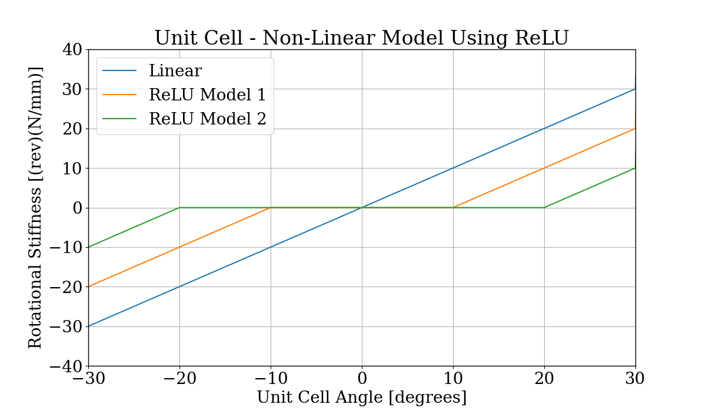

# Auxetic Lattice Backlash Model
This repository contains a set of programs to model the backlash in auxetic lattice structures.

The backlash in an auxetic structure can be configured or programmed to design a shape-changing structure.

## Main Questions
- How can we build valuable shapes using the backlash present in series and parallel networks of auxetic linkages?
- What metrics in the structure lead to changes in a configuration space?
- How do we model backlash

## Table of Contents
The programs and code for this work is split up into multiple files based on specific tasks.

- main_1D_dofs.py
  - functions to determine the DoF of 1D linkages
- main_in_2D.py
  - functions to explore 2D area differences in auxetic, high-backlash structures
- main_in_3D.py
  - functions to explore 3D deformation of auxetic, high-backlash structures
- main_airfoil.py
  - functions to examine 3D airfoil shape conformal placement
- main_configuration_space.py

#### ReLU Function for Stiffness of Cells
To model the rotational stiffness of a rotating, auxetic cell, we use a realized linear unit equation.

